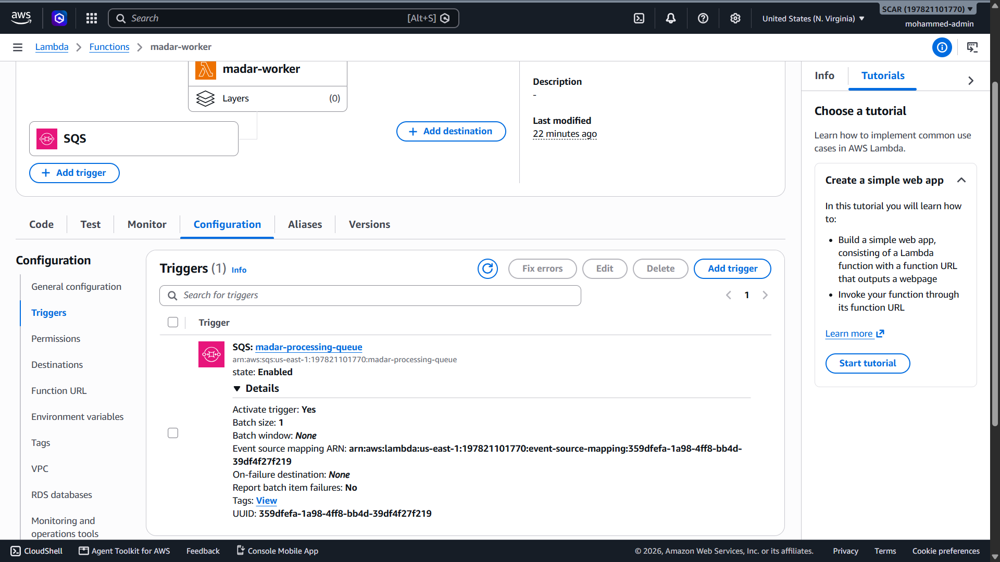
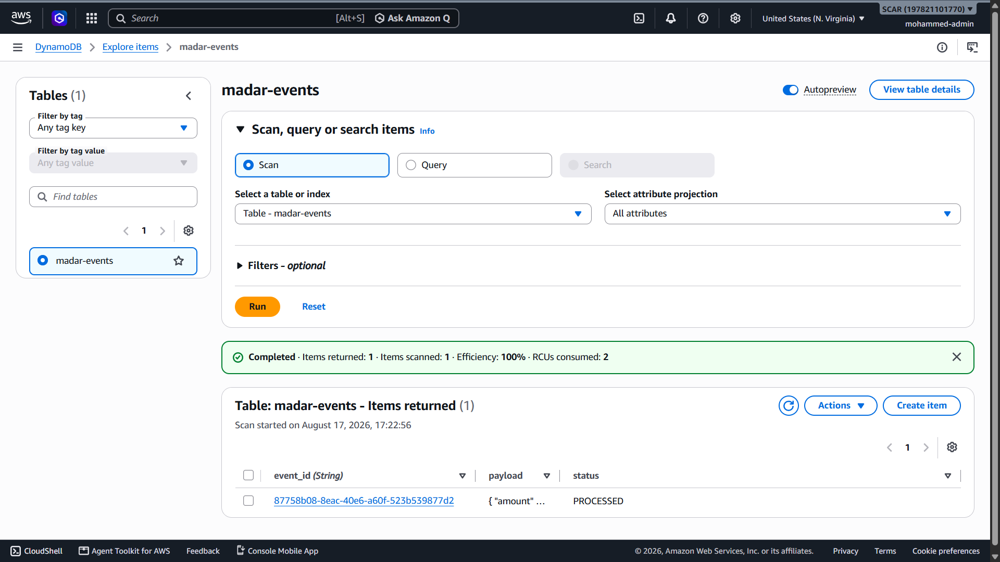
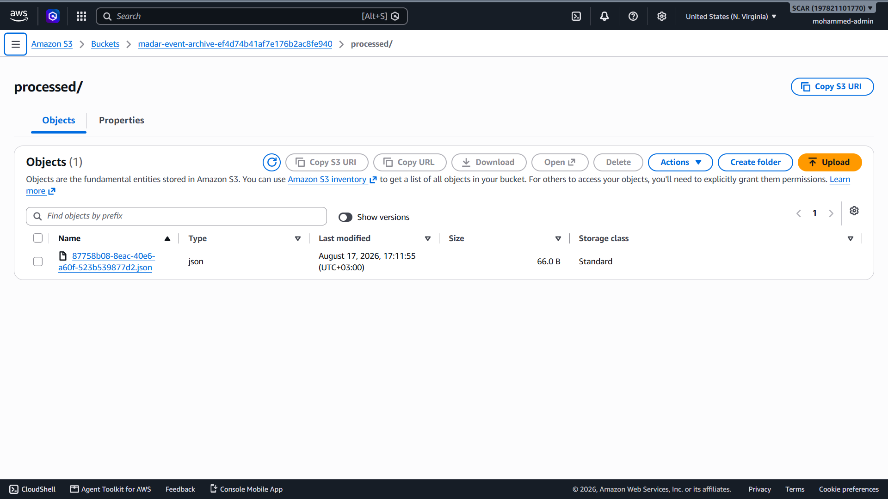
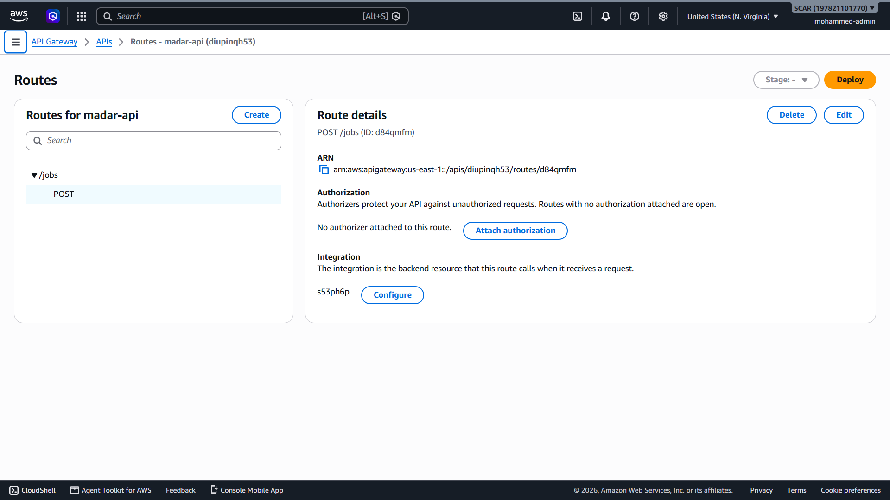

# AWS Serverless Event-Driven Application

> **Madar Cloud Transformation — Phase 2**  
> Portfolio Project 2 — Serverless, Event-Driven Architecture + Terraform Infrastructure as Code

## Company Context

**Madar (مدار)** is a fictional growing digital commerce company used as a continuous business case across this cloud engineering portfolio.

> **Portfolio note:** Madar is fictional. The architecture, implementation, testing, troubleshooting, and evidence in this repository are real hands-on portfolio work.

## Project Status

**IN PROGRESS — core serverless pipeline deployed with Terraform and the primary happy path verified end-to-end. Failure/DLQ, burst/scaling, SNS delivery, alarms, security review, and cleanup verification remain.**

## Business Problem

Madar needs to accept bursty customer/background work without coupling request intake to processing capacity. A synchronous backend can overload, time out, or require expensive always-on capacity sized for peak demand.

The solution uses a serverless asynchronous pipeline to buffer jobs, process them independently, persist status, archive results, and isolate repeated failures.

## Implemented Architecture

```text
Client
  |
  | HTTPS POST /jobs
  v
API Gateway (HTTP API)
  |
  v
Producer Lambda
  |
  +--> DynamoDB (initial job state)
  |
  v
SQS Queue
  |
  v
Worker Lambda
  |
  +--> DynamoDB (PROCESSED state)
  +--> S3 (processed event archive)
  +--> SNS (notification integration configured)
  |
  v
CloudWatch Logs

Repeated processing failure
  |
  v
SQS Dead-Letter Queue
```

## Verified Happy Path

A real HTTPS request was submitted to `POST /jobs`. API Gateway invoked the producer Lambda and returned `Job accepted` with a generated event ID. The event was queued in SQS, consumed by the worker Lambda, updated to `PROCESSED` in DynamoDB, and archived as JSON in S3. CloudWatch recorded the worker invocation.

Verified components:

- API Gateway `POST /jobs` → Producer Lambda
- Producer Lambda → SQS
- SQS → Worker Lambda event source mapping
- Worker Lambda → DynamoDB (`PROCESSED`)
- Worker Lambda → S3 processed-event archive
- Worker Lambda execution visible in CloudWatch Logs
- SQS main queue configured with a DLQ and `maxReceiveCount = 3`
- Least-privilege application IAM permissions implemented for the producer and worker

SNS integration is configured, but notification delivery has not yet been independently verified. Retry/DLQ behavior and recovery testing are also still pending.

## Runtime Evidence

### SQS → Worker Lambda



### DynamoDB processed event



### S3 processed-event archive



### API Gateway POST /jobs route



## Infrastructure as Code

The AWS environment is managed with **Terraform** rather than manually creating the project resources in the console.

```text
Write Terraform
     |
     v
terraform fmt / validate
     |
     v
terraform plan
     |
     v
terraform apply
     |
     v
Verify runtime behavior in AWS
```

Terraform currently manages the project's API Gateway, Lambda functions, SQS/DLQ, DynamoDB, S3, SNS, IAM configuration, and supporting integrations. The dependency lock file is committed for reproducible provider selection, while Terraform state and generated deployment artifacts are excluded from source control.

## Primary Technologies

**AWS:** API Gateway, Lambda, SQS, DynamoDB, S3, SNS, CloudWatch, IAM  
**Infrastructure as Code:** Terraform  
**Application code:** Python 3.13  
**Source control:** Git + GitHub

## Repository Structure

```text
.
├── README.md
├── .gitignore
├── terraform/
│   ├── .terraform.lock.hcl
│   ├── versions.tf
│   ├── providers.tf
│   ├── variables.tf
│   ├── outputs.tf
│   ├── api_gateway.tf
│   ├── sqs.tf
│   ├── lambda.tf
│   ├── dynamodb.tf
│   ├── s3.tf
│   ├── sns.tf
│   ├── cloudwatch.tf
│   └── iam.tf
├── lambda/
│   ├── producer/handler.py
│   └── worker/handler.py
├── evidence/
│   └── Screenshots/
└── docs/
```

## Engineering Principles Demonstrated

- Asynchronous/event-driven processing
- Decoupling with SQS
- Serverless compute with Lambda
- Dead-letter queue design
- Persistent job state with DynamoDB
- Result archival with S3
- Infrastructure as Code with Terraform
- Least-privilege IAM
- HTTPS API entry point
- CloudWatch execution visibility
- Runtime verification rather than configuration-only claims

## Remaining Verification

Before this portfolio project is marked complete, the remaining work includes:

- Verify SNS notification delivery
- Inject failures and verify three receives followed by DLQ routing
- Verify DLQ recovery/redrive behavior
- Run burst/scaling tests
- Complete CloudWatch metrics/alarms verification
- Complete security review
- Update architecture with final measured behavior
- Run `terraform destroy` when the lab is complete
- Verify no residual resources and perform final billing check

## Project Rules

1. The repository distinguishes between **Planned**, **Configured**, and **Verified**.
2. No feature is marked complete until its actual runtime behavior is tested.
3. No AWS secrets, access keys, tokens, or Terraform state files are committed.
4. Terraform changes are reviewed with `terraform plan` before `terraform apply`.
5. Cleanup is part of the project and must be verified after `terraform destroy`.
6. Portfolio claims describe only what was actually implemented and verified.
7. Madar is a fictional company; it is business context, not claimed employment or client work.

## Documentation

- [`docs/business-problem.md`](docs/business-problem.md) — business case and success criteria
- [`docs/architecture.md`](docs/architecture.md) — architecture and design decisions
- [`docs/implementation-checklist.md`](docs/implementation-checklist.md) — build checklist
- [`docs/progress.md`](docs/progress.md) — current implementation status
- [`docs/testing-verification.md`](docs/testing-verification.md) — runtime, failure, burst, and recovery tests
- [`docs/security.md`](docs/security.md) — IAM and application security checklist
- [`docs/cost-cleanup.md`](docs/cost-cleanup.md) — cost guardrails and cleanup verification
- [`docs/lessons-learned.md`](docs/lessons-learned.md) — engineering decisions and lessons
